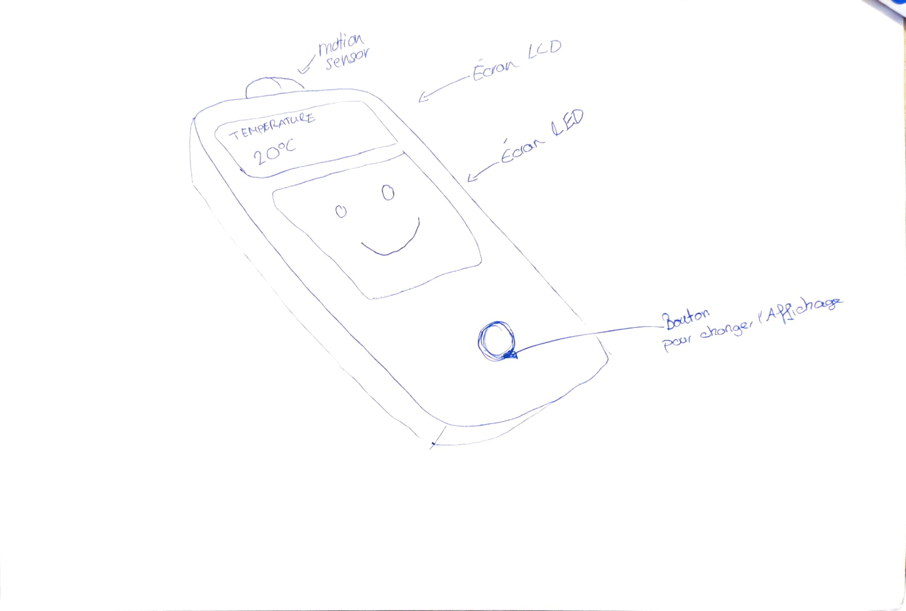
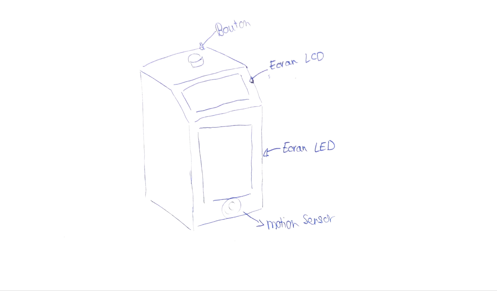

# Documentation

## Recherche et conception

Dans les salles de classe, il fait souvent chaud et elles manquent d'aération, ce qui réduit la quantité d'oxygène disponible et impacte la concentration. C'est pour cette raison que j'ai saisi l'opportunité de créer un détecteur de qualité de l'air afin de remédier à ce problème.

>Source : https://www.u-buy.ch/fr/product/47MMJS6W0-authentic-nintendo-gameboy-pocket-red-100-oem

Pour rendre le dispositif à la fois ludique et attrayant, je me suis inspirée du design des Game Boys et des anciennes consoles de jeux vidéo. Le projet, baptisé GameAir, propose plusieurs fonctionnalités afin d’offrir une expérience complète et utile :

- **Affichage de la température sur un écran LCD** : En fonction de la température (chaud, froid ou tempéré), un smiley correspondant apparaît sur la matrice de LED RGB.
- **Affichage du taux d'humidité** : plus le taux d'humidité est élevé, plus les LEDs s'allument sur la matrice pour une représentation visuelle immédiate.
- **Affichage du niveau de CO2** : lorsque le taux de CO2 dépasse 1000 ppm, un symbole d'alerte apparaît sur la matrice de LED, et un buzzer retentit toutes les 3 minutes tant que la concentration reste trop élevée.
- **Détecteur de mouvement intégré** : si aucune présence n'est détectée, les écrans restent éteints. En revanche, dès qu'une personne est présente, les écrans s'allument automatiquement.

## Circuit électronique

Lors de ce projet, j'ai utilisé plusiers composants et principalement des capteurs : 
- **Matrice de LED** : J'ai commencé par utiliser [une matrice LED rouge 16x16](matriceLed.md), mais comme le rendu n'étais pas convainquant, j'ai décidé de changer de matrice et d'utiliser la [8X8 matrice RGB de Purecrea](https://download.bastelgarage.ch/Datasheet/WS2812_Datasheet.pdf). Cette matrice est beaucoup plus simple à utiliser notamement grâce aux librairies déjà existantes.
- **Ecran LCD** : Grâce à la librairie déjà existante, cet écran est simple à utiliser. [Lien vers la datasheet](https://cdn-shop.adafruit.com/datasheets/TC1602A-01T.pdf)
- **Buzzer Piezo**
- **Capteur de mouvement** : J'ai utilisé le [PIR HC-SR501](motion.md)

- **Capteur de C02** : J'ai utiliser le [SGP30](co2.md)
- **Capteur de température & de l'humidité** : J'ai utilisé le [DHT11 temperature and humidity sensor](temp.md)

### Schéma

### BOM

| Réf | Composant      | Quantité | Description                            | Fournisseur / Lien                                            |
| --- | -------------- | -------- | -------------------------------------- | ------------------------------------------------------------- |
| 1   | arduino mega 2560 | 1        | microcontroller  ATmega2560             | [Arduino](https://store.arduino.cc/products/arduino-mega-2560-rev3?srsltid=AfmBOooEsDgttlmfXt6TIMQEybFGjIAtUWPdZocjrgAigUoTtlJHSqeI) |
| 2   | Breadboard     | 2        | Plaque de prototypage                  | [Digitec](https://www.digitec.ch/en/s1/product/velleman-high-quality-plug-in-board-electronics-supplies-casing-6337139?dbq=1&supplier=406802&utm_source=google&utm_medium=cpc&utm_campaign=PROD_CH_PMAX_M10_C3&campaignid=20563498272&adgroupid=&adid=&dgCidg=CjwKCAiArKW-BhAzEiwAZhWsIAaCYQ7k-989yrUsFd2PH1lfrgHd4hD-W7QYMFoHrthBcY65C-JNjBoCgeUQAvD_BwE&gad_source=1&gclid=CjwKCAiArKW-BhAzEiwAZhWsIAaCYQ7k-989yrUsFd2PH1lfrgHd4hD-W7QYMFoHrthBcY65C-JNjBoCgeUQAvD_BwE&gclsrc=aw.ds)                                                     |
| 3   | LCD screen  | 1        | 16x2 (6,6cm) | [Conrad](https://www.conrad.ch/de/p/joy-it-com-lcd-16x2-display-modul-6-6-cm-2-6-zoll-16-x-4-pixel-passend-fuer-entwicklungskits-arduino-mit-hintergrund-1656369.html?utm_source=google-shopping-de&utm_medium=search&utm_campaign=shopping-online-de&utm_content=shopping-ad_cpc&WT.srch=1&ef_id=CjwKCAiArKW-BhAzEiwAZhWsIFhmZZmmjOx5CVrHIFcA8Fc68ff0czC_YqTdxQCPSleyfAuhVmnF5hoCoeQQAvD_BwE%3AG%3As&utm_source=google&utm_medium=cpc&utm_campaign=DE_Sales_B2C-PMax&utm_id=19885687821&gad_source=1&gclid=CjwKCAiArKW-BhAzEiwAZhWsIFhmZZmmjOx5CVrHIFcA8Fc68ff0czC_YqTdxQCPSleyfAuhVmnF5hoCoeQQAvD_BwE&refresh=true)                                                     |
| 4  | Buzzer Piezo  | 1        | 1,5V | [Digikey](https://www.digikey.ch/de/products/detail/murata-electronics/PKM22EPPH2001-B0/1219322?gclsrc=aw.ds&&utm_adgroup=&utm_source=google&utm_medium=cpc&utm_campaign=PMax%20Shopping_Product_Medium%20ROAS&utm_term=&productid=1219322&utm_content=&utm_id=go_cmp-20185743540_adg-_ad-__dev-c_ext-_prd-1219322_sig-CjwKCAiArKW-BhAzEiwAZhWsILhCJy1YbGRHuMGCPiLcclGUsZwFfqsN8_XoWO8UTo5YmMFmuYTcnhoC3vcQAvD_BwE&gad_source=1&gclid=CjwKCAiArKW-BhAzEiwAZhWsILhCJy1YbGRHuMGCPiLcclGUsZwFfqsN8_XoWO8UTo5YmMFmuYTcnhoC3vcQAvD_BwE&gclsrc=aw.ds)
| 5   | 8x8 LED matrix  | 1        | Purecrea NeoPixel NeoMatrix 8x8 - 64 WS2812 RGB LED | [Digitec](https://www.digitec.ch/de/s1/product/purecrea-neopixel-neomatrix-8x8-64-ws2812-rgb-led-aktive-bauelemente-36133371?supplier=8244233&utm_source=google&utm_medium=cpc&utm_campaign=PROD_CH_PMAX_M4_C2&campaignid=21028152894&adgroupid=&adid=&dgCidg=CjwKCAiArKW-BhAzEiwAZhWsIHk8aj9_1UpEUAWth0OnGlZBfdjCOHDetCGEtWjYtEZrC7tKwzNXcRoCJzQQAvD_BwE&gad_source=1&gclid=CjwKCAiArKW-BhAzEiwAZhWsIHk8aj9_1UpEUAWth0OnGlZBfdjCOHDetCGEtWjYtEZrC7tKwzNXcRoCJzQQAvD_BwE&gclsrc=aw.ds)        
| 6   | Détecteur de mouvements  | 1        | Module détecteur de mouvement PIR Purecrea HC-SR501 | [Digitec](https://www.digitec.ch/de/s1/product/purecrea-hc-sr501-pir-bewegungsmelder-modul-entwicklungsboard-kit-39552366?supplier=8244233&utm_source=google&utm_medium=cpc&utm_campaign=PROD_CH_PMAX_M5_C3&campaignid=21028347594&adgroupid=&adid=&dgCidg=CjwKCAiArKW-BhAzEiwAZhWsIGnYhyyxEVa03YQIxCNnsmhPyDDtMKoK9i62ruziyytVX3uguEP6cBoCWDkQAvD_BwE&gad_source=1&gclid=CjwKCAiArKW-BhAzEiwAZhWsIGnYhyyxEVa03YQIxCNnsmhPyDDtMKoK9i62ruziyytVX3uguEP6cBoCWDkQAvD_BwE&gclsrc=aw.ds) 
| 7   | Gas Sensor SGP30  | 1        | Gaz, humidité, qualité de l'air intérieur (QAI) | [DigiKey](https://www.digikey.ch/de/products/detail/adafruit-industries-llc/3709/8258468?gclsrc=aw.ds&&utm_adgroup=&utm_source=google&utm_medium=cpc&utm_campaign=PMax%20Shopping_Product_Medium%20ROAS&utm_term=&productid=8258468&utm_content=&utm_id=go_cmp-20185743540_adg-_ad-__dev-c_ext-_prd-8258468_sig-CjwKCAiArKW-BhAzEiwAZhWsIDwvwmuVHudxKjVun_it0hJDGl3P9dqkGIU85tK9ymZ3MORhnfWHUBoCiAwQAvD_BwE&gad_source=1&gclid=CjwKCAiArKW-BhAzEiwAZhWsIDwvwmuVHudxKjVun_it0hJDGl3P9dqkGIU85tK9ymZ3MORhnfWHUBoCiAwQAvD_BwE&gclsrc=aw.ds)  
| 8   | Temperature and humidity sensor  | 1        | DHT11 Temperature and Humidity Sensor  | [DFrobot](https://wiki.dfrobot.com/DHT11_Temperature_and_Humidity_Sensor__SKU__DFR0067_) 
| 9   | TBouton  | 1        | Bouton  | [Digitec](https://www.digitec.ch/de/s1/product/purecrea-taster-button-set-25-stueck-diverse-farben-taster-schalter-39044933?supplier=8244233&utm_source=google&utm_medium=cpc&utm_campaign=PROD_CH_PMAX_M8_C2&campaignid=20573313541&adgroupid=&adid=&dgCidg=CjwKCAiArKW-BhAzEiwAZhWsIP3oUBSCLJejSXYRIfIWVGLrj-1g_8YoNgswReosx25sEoReqgX24RoCiDYQAvD_BwE&gad_source=1&gclid=CjwKCAiArKW-BhAzEiwAZhWsIP3oUBSCLJejSXYRIfIWVGLrj-1g_8YoNgswReosx25sEoReqgX24RoCiDYQAvD_BwE&gclsrc=aw.ds)   
| 10   | Resitance  | 2        | Résitances  | [DFrobot](https://www.digitec.ch/de/s1/product/kemo-widerstands-set-widerstand-21606532?supplier=8902998&utm_source=google&utm_medium=cpc&utm_campaign=PROD_CH_PMAX_M7_C3&campaignid=21035137829&adgroupid=&adid=&dgCidg=CjwKCAiArKW-BhAzEiwAZhWsIKcbYjfA3OyaWwjOD4VI8b8xrBx978schU2VPuRLQ12B1Mq9LNfb9BoCoZ8QAvD_BwE&gad_source=1&gclid=CjwKCAiArKW-BhAzEiwAZhWsIKcbYjfA3OyaWwjOD4VI8b8xrBx978schU2VPuRLQ12B1Mq9LNfb9BoCoZ8QAvD_BwE&gclsrc=aw.ds)    
| 11   | Potentiomètre  | 1        | Potentiomètre  | [Digitec](https://www.digitec.ch/de/s1/product/purecrea-10k-ohm-linear-drehpotentiometer-3386p-1-103-potentiometer-passive-bauelemente-36225564?supplier=8244233&utm_source=google&utm_medium=cpc&utm_campaign=PROD_CH_PMAX_M3_C3&campaignid=21028153113&adgroupid=&adid=&dgCidg=CjwKCAiArKW-BhAzEiwAZhWsIIbTKjDeSVM4sTbrzXFLuUiracUvi6idL3fI5uOMU0PZ1lLEY_pA7xoCDTAQAvD_BwE&gad_source=1&gclid=CjwKCAiArKW-BhAzEiwAZhWsIIbTKjDeSVM4sTbrzXFLuUiracUvi6idL3fI5uOMU0PZ1lLEY_pA7xoCDTAQAvD_BwE&gclsrc=aw.ds)                                                                             

## Programme
Dans ce projet, j'ai utilisé plusieurs librairies pour optimiser les fonctionnalités. La librairie LiquidCrystal me permet de gérer l'affichage sur un écran LCD, essentiel pour afficher des informations comme la température, l'humidité ou encore le niveau de CO2. J'ai également utilisé la librairie DHT pour le capteur d'humidité et de température, et Adafruit_SGP30 pour le capteur de qualité de l'air, mesurant le CO2 et les TVOC. Pour rendre l'interface plus visuelle et ludique, j'ai intégré la librairie FastLED afin de contrôler une matrice LED RGB 8x8, qui affiche des smileys et des indicateurs en fonction des données mesurées.
Pour éviter les rebonds du bouton et permettre au code de gérer plusieurs tâches en parallèle, j'ai utilisé la fonction millis(), ce qui permet de ne pas interrompre le fonctionnement du programme.

## Roadmap
Il y a encore plusieurs points à améliorer dans le projet. Par exemple, le buzzer ne peut pas être arrêté une fois activé, ce qui pourrait rapidement devenir agaçant. De plus, les visuels affichés sur la matrice de LED sont pour l'instant très statiques. Pour rendre l'appareil plus interactif et attractif, il serait intéressant de rendre ces visuels animés ou de les rendre plus dynamiques et détaillés, en intégrant par exemple des transitions ou des animations plus sophistiquées.